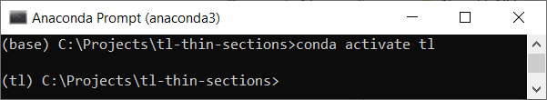
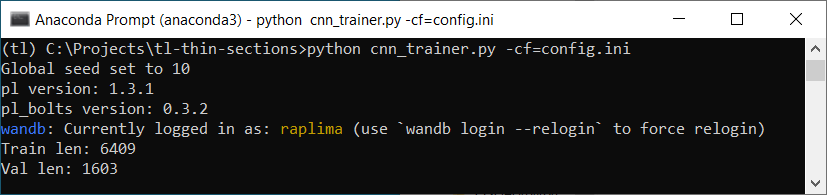

# tl-thin-sections
Transfer learning experiments for petrographic thin sections using [PyTorch Lightning](https://www.pytorchlightning.ai/).

This is the code used for [Pretraining Convolutional Neural Networks for Mudstone Petrographic Thin-Section Image Classification](https://www.mdpi.com/2076-3263/11/8/336).  

```bibtex
@article{pires_de_lima_duarte_pretraining_2021,
	title = Pretraining Convolutional Neural Networks for Mudstone Petrographic Thin-Section Image Classification,
	volume = {11},
	copyright = {http://creativecommons.org/licenses/by/3.0/},
	url = {https://www.mdpi.com/2076-3263/11/8/336},
	doi = {10.3390/geosciences11080336},
	language = {en},
	number = {8},
	urldate = {2021-08-12},
	journal = {Geosciences},
	author = {Pires de Lima, Rafael and Duarte, David},
	month = aug,
	year = {2021},
	note = {Number: 8
	Publisher: Multidisciplinary Digital Publishing Institute},
	keywords = {convolutional neural networks, petrography, thin-section images, transfer learning},
	pages = {336},
}
```
[This commit](https://github.com/raplima/tl-thin-sections/tree/d82bee0e72503522592c629068690e07ffd50414) shows the repository image when paper was reviewed and published. 


# Getting started
Clone this repository to your local machine using your tool of choice. Install [Anaconda](https://www.anaconda.com/) if you don't have it and open the [Anaconda Prompt](https://docs.anaconda.com/anaconda/user-guide/getting-started/). Navigate to the location of the cloned repository and install the [environment](environment.yml) using the command:  
`conda env create -f environment.yml`

Then, follow the instructions to activate the newly installed environment:  
`conda activate tl`

The terminal should look something like this:  


Now you should be able to use transfer learning with the [cnn_trainer.py](./cnn_trainer.py) script and a [config.ini](./config.ini) file using:

`pytyhon cnn_trainer.py -cf=config.ini`

The terminal will print some information before training starts:



The [exported_env.yml](./exported_env.yml) file is the exported environment used in the experiments.
